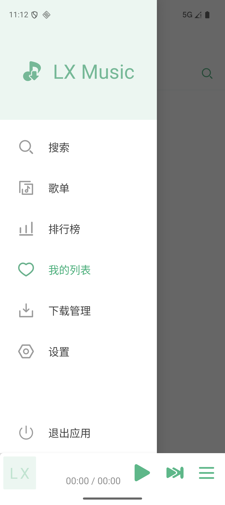
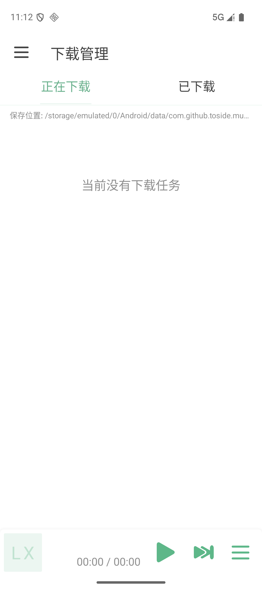
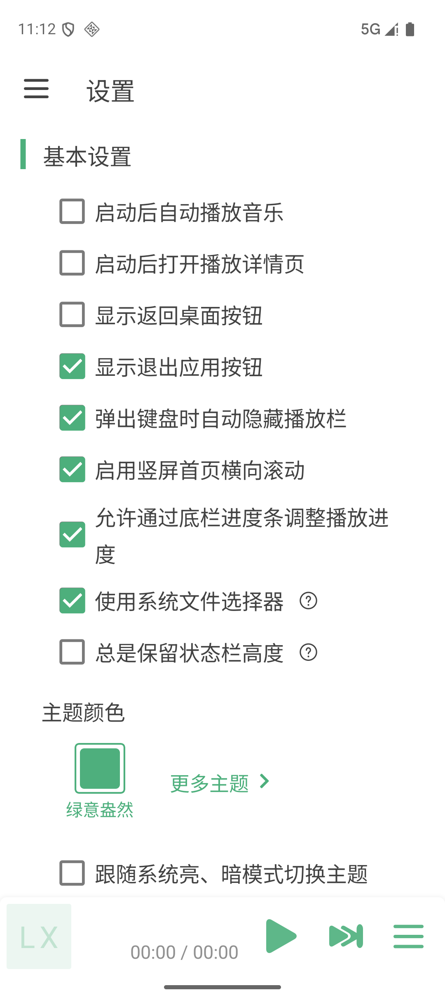

<h1 align="center">LX Music 移动加强版</h1>

  
  
  

在 LX Music 移动版基础上做加法：补齐下载、备份和播放队列，并持续优化 Android 体验。

本项目修改自落雪无痕开发的 [LX Music 移动版](https://github.com/lyswhut/lx-music-mobile)，保留上游已有功能；当前版本暂不包含网易云账号登录，重点增强日常使用中缺少的下载、备份和交互功能。

- 本仓库：<https://github.com/hedroid/lx-music-mobile>
- Release 下载：<https://github.com/hedroid/lx-music-mobile/releases>
- 原仓库（上游）：<https://github.com/lyswhut/lx-music-mobile>

## 本版主要增强

### 下载与本地播放

- 歌曲菜单、播放详情页和歌单批量选择均可直接下载。
- 增加独立的下载管理页面，区分正在下载和已下载任务，支持失败重试、取消与删除。
- 支持下载音质、保存路径、文件命名、歌词及封面写入，并可按歌手/专辑自动建立目录。
- 支持 1–50 个并行下载任务；遇到已下载歌曲时可选择跳过或重新下载。
- 已下载歌曲优先从本地文件播放；移除记录时可选择是否同时删除本地文件。

### 播放队列

- 播放栏上滑即可打开当前播放队列，下滑关闭。
- 支持拖动调整顺序、清空队列和一键移除歌曲。
- 当前歌曲具有明确的播放状态，队列条目的封面与歌曲信息展示保持一致。

### 备份与恢复

- 本地备份和 WebDAV 云端备份使用同一套完整数据格式。
- 可备份与恢复歌单、自定义音源、应用设置和屏蔽规则。
- WebDAV 支持连接测试、立即备份和云端恢复，默认兼容坚果云地址。

### 歌单与列表体验

- 歌单可显示歌曲专辑封面，并对图片缓存和滚动加载进行优化。
- 支持长按进入多选、全选和批量下载，收藏状态直接显示在歌单封面上。
- 统一搜索、歌单和排行榜的音源选择及顶部操作栏样式。
- 修复部分网易云歌单、排行榜和歌曲详情解析异常。

### Android 与界面适配

- 应用 ID 为 `com.github.toside.music`，可与原版同时安装。
- 最低支持 Android 11，目标 Android 16，并适配 16KB 内存页设备。
- 升级 React Native、Navigation、Android SDK、NDK 和 Gradle，保持 React Native 新架构启用。
- 调整系统安全区、播放器位置、弹窗手势、中文/英文及多档字体大小下的对齐与换行。
- 使用扁平化自适应图标，统一按钮、复选框、滑杆、菜单和顶部标签的视觉细节。

完整版本变化可查看 [CHANGELOG.md](CHANGELOG.md)。

## 应用截图

  
  
  

导航菜单 · 下载管理 · 设置与外观

## 安装与要求

- 支持 Android 11 及以上版本。
- 推荐从本仓库的 [GitHub Releases](https://github.com/hedroid/lx-music-mobile/releases) 下载 APK。
- 其他渠道的安装包可能并非由本仓库构建，请注意核对应用 ID 和版本号。

目前没有计划支持 iOS 和 HarmonyOS NEXT。

## 项目关系与文档

技术栈：React Native + Redux。

- 上游移动版：<https://github.com/lyswhut/lx-music-mobile>
- 上游桌面版：<https://github.com/lyswhut/lx-music-desktop>
- 移动版常见问题：<https://lyswhut.github.io/lx-music-doc/mobile/faq>
- 音乐播放列表机制：<https://lyswhut.github.io/lx-music-doc/mobile/faq/playlist>

## TODO

- [ ] 支持连接 OneDrive，同步与备份应用数据
- [ ] 增加网易云账号登录，并支持登录状态与 Cookie 安全管理
- [ ] 支持收藏歌手
- [ ] 增加歌手详情页
- [x] 支持通知栏音乐胶囊歌词滚动显示
- [x] 优化桌面歌词：应用内隐藏、自动收起边框及播放控制与样式调整
- [x] 完成灵动岛歌词滚动显示与开关
- [ ] 支持歌词中英文双语显示，并适配桌面歌词、播放页歌词和通知栏歌词
- [x] 支持选择 Android 内置字体或导入 TTF/OTF 文件修改应用字体，并可恢复系统默认字体
- [ ] 优化崩溃日志展示，区分 JS 崩溃、Native 崩溃、ANR 和初始化失败
- [ ] 增加一键复制崩溃日志功能，便于反馈问题时直接粘贴
- [ ] 检测到上次异常退出或崩溃时，下次启动提示用户查看错误日志
- [ ] 打包验证真实崩溃场景下日志写入是否完整

## 贡献代码

欢迎提交 Issue 和 PR。修复问题时请附复现步骤；增加功能时请说明使用场景和交互方式。开发环境可参考上游的[源码使用方法](https://lyswhut.github.io/lx-music-doc/mobile/use-source-code)，开发分支使用 `dev`。

## 项目协议

本项目基于 [Apache License 2.0](https://github.com/lyswhut/lx-music-mobile/blob/master/LICENSE) 许可证发行，以下协议是对于 Apache License 2.0 的补充，如有冲突，以以下协议为准。

---

*词语约定：本协议中的“本项目”指 LX Music（洛雪音乐）移动版项目；“使用者”指签署本协议的使用者；“官方音乐平台”指对本项目内置的包括酷我、酷狗、咪咕等音乐源的官方平台统称；“版权数据”指包括但不限于图像、音频、名字等在内的他人拥有所属版权的数据。*

### 一、数据来源

1.1 本项目的各官方平台在线数据来源原理是从其公开服务器中拉取数据（与未登录状态在官方平台 APP 获取的数据相同），经过对数据简单地筛选与合并后进行展示，因此本项目不对数据的合法性、准确性负责。

1.2 本项目本身没有获取某个音频数据的能力，本项目使用的在线音频数据来源来自软件设置内“自定义源”设置所选择的“源”返回的在线链接。例如播放某首歌，本项目所做的只是将希望播放的歌曲名、艺术家等信息传递给“源”，若“源”返回了一个链接，则本项目将认为这就是该歌曲的音频数据而进行使用，至于这是不是正确的音频数据本项目无法校验其准确性，所以使用本项目的过程中可能会出现希望播放的音频与实际播放的音频不对应或者无法播放的问题。

1.3 本项目的非官方平台数据（例如“我的列表”内列表）来自使用者本地系统或者使用者连接的同步服务，本项目不对这些数据的合法性、准确性负责。

### 二、版权数据

2.1 使用本项目的过程中可能会产生版权数据。对于这些版权数据，本项目不拥有它们的所有权。为了避免侵权，使用者务必在 **24 小时内** 清除使用本项目的过程中所产生的版权数据。

### 三、音乐平台别名

3.1 本项目内的官方音乐平台别名为本项目内对官方音乐平台的一个称呼，不包含恶意。如果官方音乐平台觉得不妥，可联系本项目更改或移除。

### 四、资源使用

4.1 本项目内使用的部分包括但不限于字体、图片等资源来源于互联网。如果出现侵权可联系本项目移除。

### 五、免责声明

5.1 由于使用本项目产生的包括由于本协议或由于使用或无法使用本项目而引起的任何性质的任何直接、间接、特殊、偶然或结果性损害（包括但不限于因商誉损失、停工、计算机故障或故障引起的损害赔偿，或任何及所有其他商业损害或损失）由使用者负责。

### 六、使用限制

6.1 本项目完全免费，且开源发布于 GitHub 面向全世界人用作对技术的学习交流。本项目不对项目内的技术可能存在违反当地法律法规的行为作保证。

6.2 **禁止在违反当地法律法规的情况下使用本项目。** 对于使用者在明知或不知当地法律法规不允许的情况下使用本项目所造成的任何违法违规行为由使用者承担，本项目不承担由此造成的任何直接、间接、特殊、偶然或结果性责任。

### 七、版权保护

7.1 音乐平台不易，请尊重版权，支持正版。

### 八、非商业性质

8.1 本项目仅用于对技术可行性的探索及研究，不接受任何商业（包括但不限于广告等）合作及捐赠。

### 九、接受协议

9.1 若你使用了本项目，即代表你接受本协议。

---

若对此有疑问请 mail to: lyswhut+qq.com (请将 `+` 替换成 `@`)
